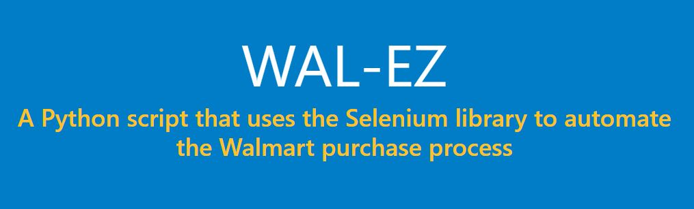

# 																WAL-EZ (2018)

### The script to easily purchase hot items  🔥 🧻 📈

- It all started in 2018 with a simple request from my cousin to recapture a slice of his childhood from Walmart's rare restocks.

## Automated, Fast, Purchasing.

- with the necessary information WAL-EZ automates the purchase process from login to checkout

## Install

* Make sure you have [Python 3.6](https://www.python.org/downloads/) installed! Once Python is installed make sure to have the [WebDriver for Chrome](https://sites.google.com/a/chromium.org/chromedriver/downloads) installed as well so that Selenium can interact with Chrome! For Windows just unzip the chromedriver_win32 .zip file that you downloaded and make sure to put the chromedriver.exe found inside in the same folder as where you installed Python. Also make sure you have [uBlock Origin](https://chrome.google.com/webstore/detail/ublock-origin/cjpalhdlnbpafiamejdnhcphjbkeiagm?) as an extension for Chrome.
* To run the script right click the .py file and edit it with IDLE then press F5. Make sure all you know your Walmart login, and that the proper info ex. credit card and shipping address have been saved to your Walmart account. I reccomend not using your current Chrome user data(leaving the prompt blank or typing 'n'), and instead automatically sign in everytime you run the script, as using your current Chrome user data has been kinda spotty in my experience.
